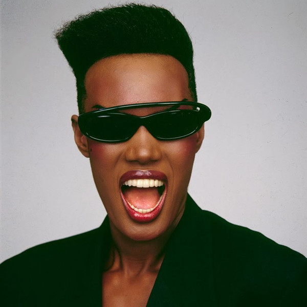

# Grace Jones

## Artist Profile

Jamaican singer, actress and supermodel born on May 19, 1948 [some sources claim 1950 or 1952] in Spanish Town, Jamaica, West Indies. She moved to Syracuse, New York, in her early teens, where her parents had relocated and founded the Apostolic Church of Jesus Christ.
She moved to New York at 18 and began a modelling career that took her to Paris where she worked for Yves Saint Laurent, Azzedine Alaïa and Kenzo Takada and photographers such as Helmut Newton and Guy Bourdin. While in Paris, she branched out into a recording career, first as a disco diva, working with Tom Moulton, before evolving towards a reggae / new wave sound created at Compass Point Studios with Sly &amp; Robbie and marked by striking visuals created by her then partner Jean-Paul Goude.
Her first connection with music perhaps is her uncredited appearance on the cover of the 1973 reissue of Billy Paul - Ebony Woman.
She published her autobiography in 2015, I'll Never Write My Memoirs (a line taken from her song Art Groupie), co-written with Paul Morley, in which she comes back on her early childhood in Jamaica, denies some longstanding rumours and fuels a few new ones.
Grace is the granddaughter of Dan Williams (8), daughter of Marjorie Jones, sister of Bishop Noel Jones and Chris Jones (20), and mother of Paulo Goude.

## Artist Links

- [https://gracejones.com/](https://gracejones.com/)
- [http://www.facebook.com/GraceJonesOfficial](http://www.facebook.com/GraceJonesOfficial)
- [http://www.instagram.com/gracejonesofficial](http://www.instagram.com/gracejonesofficial)
- [http://twitter.com/Miss_GraceJones](http://twitter.com/Miss_GraceJones)
- [http://en.wikipedia.org/wiki/Grace_Jones](http://en.wikipedia.org/wiki/Grace_Jones)
- [http://www.youtube.com/user/GraceJonesVEVO](http://www.youtube.com/user/GraceJonesVEVO)

## See also

- [Nightclubbing](Nightclubbing.md)
