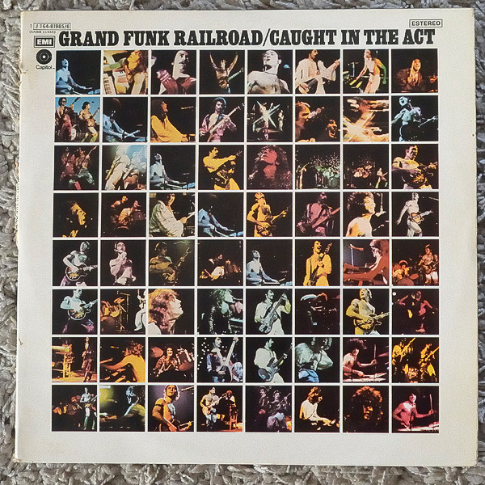

# Caught In The Act

By Grand Funk Railroad

## Album Data

[Discogs URL](https://www.discogs.com/release/4966050-Grand-Funk-Railroad-Caught-In-The-Act)

- Label: Capitol Records
- Formats: Vinyl, LP, Album, Club Edition
- Genres: Rock, Hard Rock, Rock & Roll, Pop Rock
- Rating: 4.12
- Released: 1975
- Year: 1975
- Release ID: 4966050
- Media condition: 
- Sleeve condition: 
- Speed: 
- Weight: 
- Notes: 

## Album Tracks

| **Position** | **Title** | **Duration** |
|--------------|-----------|--------------|
| A1 | **Introduction** | 2:47 |
| A2 | **Foot Stompin' Music** | 4:02 |
| A3 | **Rock & Roll Soul** | 3:59 |
| A4 | **Closer To Home** | 7:14 |
| B1 | **Heartbreaker** | 7:38 |
| B2 | **Some Kind Of Wonderful** | 4:05 |
| B3 | **Shinin' On** | 5:40 |
| B4 | **The Loco-Motion** | 3:14 |
| C1 | **Black Licorice** | 4:55 |
| C2 | **The Railroad** | 6:15 |
| C3 | **We're An American Band** | 3:45 |
| C4 | **T.N.U.C.** | 9:13 |
| D1 | **Inside Lookin' Out** | 12:11 |
| D2 | **Gimme Shelter** | 6:15 |

## Artist Roles

| **Name** | **Role** |
|----------|----------|
| **Lymbo Inc.** | Art Direction |
| **The Funkettes** | Backing Vocals |
| **Jana (17)** | Backing Vocals  [Funkette] |
| **Lorraine Feather** | Backing Vocals [Funkette] |
| **Mel Schacher** | Bass, Backing Vocals |
| **Beth Ellor** | Design [Costume Design] |
| **Dina Gary** | Design [Costume Design] |
| **J. Jamerson** | Design [Costume Design] |
| **Joe Barbaria** | Engineer [Assistant-O.D.O. Studios] |
| **David Hewitt** | Engineer [Assistant-The Record Plant East Mobile Unit] |
| **Rod O'Brien** | Engineer [Assistant-The Record Plant East Mobile Unit] |
| **Jack Sherdel** | Engineer [O.D.O. Studios] |
| **Carmine Rubino** | Engineer [The Record Plant East Mobile Unit] |
| **Craig Frost** | Keyboards, Percussion, Backing Vocals |
| **Mark Farner** | Organ |
| **Lynn Goldsmith** | Photography By |
| **Jimmy Ienner** | Producer |
| **Don Brewer** | Vocals, Drums, Percussion |
| **Mark Farner** | Vocals, Guitar [Guitars], Harp |

