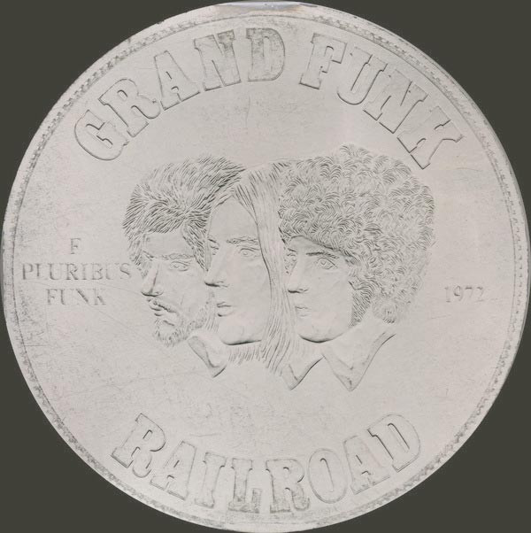

# E Pluribus Funk

By Grand Funk Railroad

## Album Data

[Discogs URL](https://www.discogs.com/release/853184-Grand-Funk-Railroad-E-Pluribus-Funk)

- Label: Capitol Records
Capitol Records
- Formats: Vinyl, LP, Album, Stereo
- Genres: Rock, Hard Rock, Funk
- Rating: 3.95
- Released: 1971-11-17
- Year: 1971
- Release ID: 853184
- Media condition: 
- Sleeve condition: 
- Speed: 
- Weight: 
- Notes: 

## Album Tracks

| **Position** | **Title** | **Duration** |
|--------------|-----------|--------------|
| A1 | **Footstompin' Music** | 3:45 |
| A2 | **People, Let's Stop The War** | 5:13 |
| A3 | **Upsetter** | 4:09 |
| A4 | **I Come Tumblin'** | 5:42 |
| B1 | **Save The Land** | 4:12 |
| B2 | **No Lies** | 3:55 |
| B3 | **Loneliness** | 8:38 |

## Artist Roles

| **Name** | **Role** |
|----------|----------|
| **Mel Schacher** | Bass |
| **Craig Braun** | Design |
| **Terry Knight** | Design Concept [Cover Concept], Producer [Recording Produced By] |
| **Don Brewer** | Drums, Percussion, Vocals |
| **Ken Hamann** | Engineer [Cleveland Recording Co.] |
| **Mark Farner** | Written-By, Guitar, Organ, Harmonica, Vocals |

