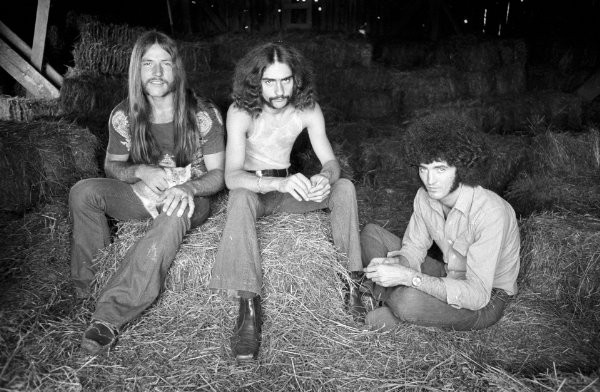

# Grand Funk Railroad

## Artist Profile

Hard Rock band from Flint, Genesee County, Michigan (USA).

The band formed in 1969.

Line-up:
Mark Farner - Vocals And Guitar
Don Brewer - Drums And Vocals
Mel Schacher - Bass
Craig Frost - Keyboards

Grand Funk Railroad (also known as Grand Funk) is an American rock band that was highly popular during the 1970s. Grand Funk Railroad toured constantly to packed arenas worldwide. David Fricke of Rolling Stone Magazine writes "You cannot talk about rock in the 1970s without talking about GRAND FUNK RAILROAD!" The band's name is a play on words of the Grand Trunk and Western Railroad, a railroad line that ran through the band's home town of Flint, Michigan.

## Artist Links

- [http://www.grandfunkrailroad.com/](http://www.grandfunkrailroad.com/)
- [http://en.wikipedia.org/wiki/Grand_Funk_Railroad](http://en.wikipedia.org/wiki/Grand_Funk_Railroad)
- [http://www.last.fm/music/Grand+Funk+Railroad](http://www.last.fm/music/Grand+Funk+Railroad)
- [http://www.facebook.com/pages/Grand-Funk-Railroad-Band/1393046374288775](http://www.facebook.com/pages/Grand-Funk-Railroad-Band/1393046374288775)
- [http://www.youtube.com/channel/UCXqDhA0ovs5DdhKPC20Z0Yg](http://www.youtube.com/channel/UCXqDhA0ovs5DdhKPC20Z0Yg)

## See also

- [Caught In The Act](Caught_In_The_Act.md)
- [E Pluribus Funk](E_Pluribus_Funk.md)
- [We're An American Band](Were_An_American_Band.md)
