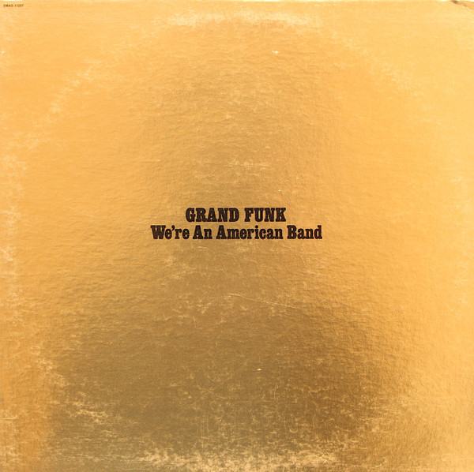

# We're An American Band

By Grand Funk Railroad

## Album Data

[Discogs URL](https://www.discogs.com/release/478853-Grand-Funk-Were-An-American-Band)

- Label: Capitol Records
- Formats: Vinyl, LP, Album
- Genres: Rock, Classic Rock
- Rating: 3.8
- Released: 1973-07-15
- Year: 1973
- Release ID: 478853
- Media condition: 
- Sleeve condition: 
- Speed: 
- Weight: 
- Notes: 

## Album Tracks

| **Position** | **Title** | **Duration** |
|--------------|-----------|--------------|
| A1 | **We're An American Band** | 3:25 |
| A2 | **Stop Lookin' Back** | 4:51 |
| A3 | **Creepin'** | 7:01 |
| A4 | **Black Licorice** | 4:43 |
| B1 | **The Railroad** | 6:07 |
| B2 | **Ain't Got Nobody** | 4:19 |
| B3 | **Walk Like A Man** | 4:03 |
| B4 | **Loneliest Rider** | 5:19 |

## Artist Roles

| **Name** | **Role** |
|----------|----------|
| **John Hoernle** | Art Direction |
| **Andrew Cavaliere** | Artwork [Concept], Design |
| **Lynn Goldsmith** | Artwork [Concept], Design |
| **Mel Schacher** | Bass |
| **Seth Snyder** | Engineer [Assistant] |
| **Craig Frost** | Organ, Piano [Electric], Keyboards [Clavinet], Synthesizer [Moog] |
| **Lynn Goldsmith** | Photography By |
| **Todd Rundgren** | Producer, Engineer |
| **Don Brewer** | Vocals, Drums, Percussion |
| **Mark Farner** | Vocals, Guitar, Acoustic Guitar, Piano [Electric], Congas |

