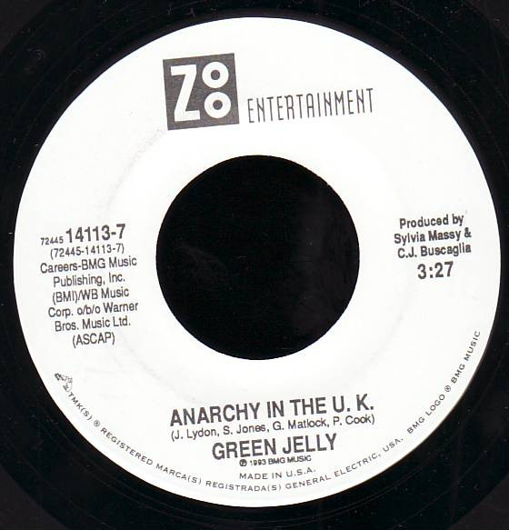

# Anarchy In The UK

By Green Jellÿ

## Album Data

[Discogs URL](https://www.discogs.com/release/4236586-Green-Jelly-Anarchy-In-The-UK)

- Label: Zoo Entertainment
- Formats: Vinyl, 7", 45 RPM, Single
- Genres: Rock, Funk Metal, Punk, Parody
- Rating: 4.67
- Released: 1993
- Year: 1993
- Release ID: 4236586
- Media condition: 
- Sleeve condition: 
- Speed: 
- Weight: 
- Notes: 

## Album Tracks

| **Position** | **Title** | **Duration** |
|--------------|-----------|--------------|
| A | **Anarchy In The UK** | 3:27 |
| B | **Green Jelly Theme Song** | 2:15 |

## Artist Roles

| **Name** | **Role** |
|----------|----------|
| **Kevin Coogan** | Management |
| **C. J. Buscaglia** | Producer |
| **Sylvia Massy** | Producer |

