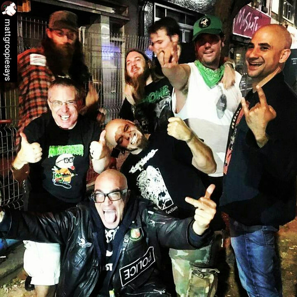

# Green Jellÿ

## Artist Profile

Metal / Punk / Comedy Rock band from California, formed in 1981.

Originally known as "Green Jellö" before they were sued by Kraft Foods for trademark infringement in 1992 (due to the use of "Jello" in their name).

Has reportedly had over 250 members over the years, with the only constant member being founder Bill Manspeaker.

## Artist Links

- [http://www.greenjellosuxx.com/](http://www.greenjellosuxx.com/)
- [https://www.facebook.com/greenjellosuxx/](https://www.facebook.com/greenjellosuxx/)
- [https://myspace.com/greenjelly](https://myspace.com/greenjelly)
- [https://en.wikipedia.org/wiki/Green_Jell%C3%BF](https://en.wikipedia.org/wiki/Green_Jell%C3%BF)

## See also

- [Anarchy In The UK](Anarchy_In_The_UK.md)
