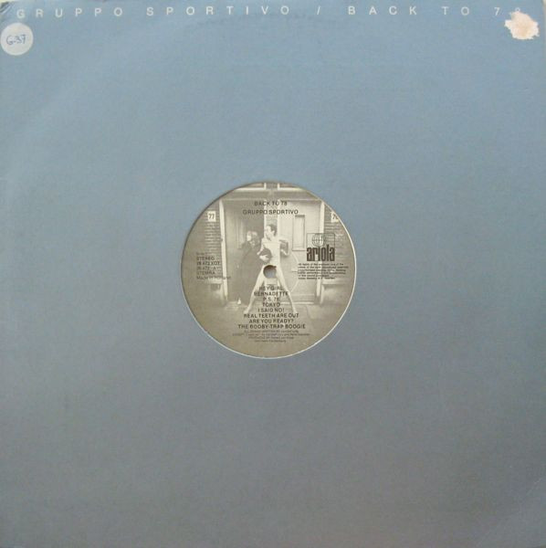

# Back To 78

By Gruppo Sportivo

## Album Data

[Discogs URL](https://www.discogs.com/release/5124089-Gruppo-Sportivo-Back-To-78)

- Label: Ariola
Ariola
- Formats: Vinyl, LP, Album
- Genres: Rock, Rock & Roll, Pop Rock
- Rating: 3.69
- Released: 1978
- Year: 1978
- Release ID: 5124089
- Media condition: 
- Sleeve condition: 
- Speed: 
- Weight: 
- Notes: 

## Album Tracks

| **Position** | **Title** | **Duration** |
|--------------|-----------|--------------|
| A1 | **Hey Girl** | 2:27 |
| A2 | **Bernadette** | 3:07 |
| A3 | **P.S. 78** | 3:03 |
| A4 | **Tokyo** | 1:13 |
| A5 | **I Said No!** | 4:16 |
| A6 | **Real Teeth Are Out** | 3:48 |
| A7 | **Are You Ready?** | 2:05 |
| A8 | **The Booby-Trap Boogie** | 3:31 |
| B1 | **Blah Blah Magazines** | 2:02 |
| B2 | **One Way Love (From Me To You)** | 3:08 |
| B3 | **I'm A Rocket** | 2:32 |
| B4 | **Shave** | 2:48 |
| B5 | **The Pogo Never Stops** | 3:18 |
| B6 | **Bottom Of The Class** | 3:03 |
| B7 | **The Single** | 1:12 |

## Artist Roles

| **Name** | **Role** |
|----------|----------|
| **Eric Wehrmeyer** | Bass |
| **Young And Ugly** | Design, Art Direction |
| **Max Mollinger** | Drums |
| **Hans Nouse** | Lacquer Cut By |
| **Josee Van Iersel** | Lead Vocals, Backing Vocals |
| **Meike Touw** | Lead Vocals, Backing Vocals |
| **Hans Vandenburg** | Lead Vocals, Guitar |
| **Peter Calicher** | Organ [Farfisa], Piano |
| **Ed De Jong** | Other [Special Thanks To] |
| **Piet Legerstee** | Other [Special Thanks To] |
| **Anton Corbijn** | Photography By [Inner Sleeve] |
| **Eef Van Os** | Photography By [Inner Sleeve] |
| **Gruppo Sportivo** | Photography By [Inner Sleeve] |
| **Ton Schutter** | Photography By [Inner Sleeve] |
| **Anton Corbijn** | Photography By [Label] |
| **Hans Vandenburg** | Producer |
| **Robert Jan Stips** | Producer |
| **Robin Freeman** | Recorded By |
| **Peter Calicher** | Written-By |
| **Van DeFruits** | Written-By |

