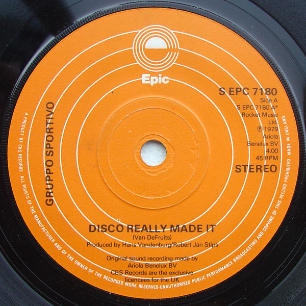

# Disco Really Made It

By Gruppo Sportivo

## Album Data

[Discogs URL](https://www.discogs.com/release/1452926-Gruppo-Sportivo-Disco-Really-Made-It)

- Label: Ariola
Ariola
- Formats: Vinyl, 7", Single, 45 RPM, Limited Edition
- Genres: Rock, New Wave, Pop Rock
- Rating: 2
- Released: 1979
- Year: 1979
- Release ID: 1452926
- Media condition: 
- Sleeve condition: 
- Speed: 
- Weight: 
- Notes: 

## Album Tracks

| **Position** | **Title** | **Duration** |
|--------------|-----------|--------------|
| A | **Disco Really Made It** | 4:00 |
| B | **I Don't Know** | 2:55 |

## Artist Roles

| **Name** | **Role** |
|----------|----------|
| **Hans Vandenburg** | Producer |
| **Robert Jan Stips** | Producer |
| **Van DeFruits** | Written-By |

