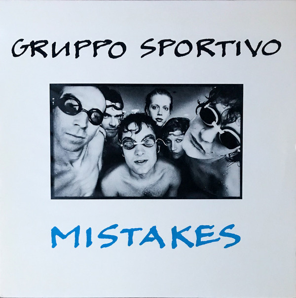

# Mistakes

By Gruppo Sportivo

## Album Data

[Discogs URL](https://www.discogs.com/release/861956-Gruppo-Sportivo-Mistakes)

- Label: Sire
- Formats: Vinyl, LP, Compilation
- Genres: Rock, New Wave, Art Rock
- Rating: 3.76
- Released: 1979
- Year: 1979
- Release ID: 861956
- Media condition: 
- Sleeve condition: 
- Speed: 
- Weight: 
- Notes: 

## Album Tracks

| **Position** | **Title** | **Duration** |
|--------------|-----------|--------------|
| A1 | **Mission A Paris** | 4:17 |
| A2 | **Dreamin'** | 4:17 |
| A3 | **Henri** | 4:21 |
| A4 | **Hey Girl** | 2:25 |
| A5 | **I Said No** | 4:14 |
| A6 | **I Shot My Manager** | 2:50 |
| B1 | **Blah Blah Magazines** | 2:01 |
| B2 | **Beep Beep Love** | 2:54 |
| B3 | **P.S. 78** | 3:00 |
| B4 | **Superman** | 6:22 |
| B5 | **One Way Love (From Me To You)** | 3:07 |
| B6 | **Bottom Of The Class** | 2:04 |
| B7 | **The Single** | 1:13 |

## Artist Roles

| **Name** | **Role** |
|----------|----------|
| **Young And Ugly** | Art Direction |
| **Eric Wehrmeyer** | Bass |
| **Anton Corbijn** | Design, Photography By |
| **Dorien Van Der Valk** | Design, Photography By |
| **Max Mollinger** | Drums, Vocals |
| **Aad Link** | Engineer |
| **Jan Schuurman** | Engineer |
| **Robin Freeman** | Engineer |
| **Hans Vandenburg** | Guitar, Vocals |
| **John Van Vueren** | Management |
| **Greg Calbi** | Mastered By |
| **Peter Calicher** | Piano, Organ, Vocals |
| **Hans Vandenburg** | Producer |
| **Robert Jan Stips** | Producer |
| **Josee Van Iersel** | Vocals |
| **Meike Touw** | Vocals |
| **Gruppo Sportivo** | Written-By |
| **Van DeFruits** | Written-By |

