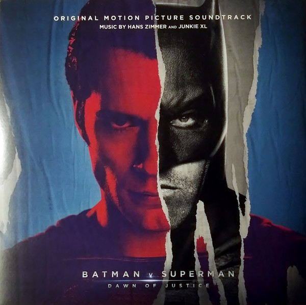

# Batman v Superman: Dawn of Justice (Original Motion Picture Soundtrack)

By Hans Zimmer

## Album Data

[Discogs URL](https://www.discogs.com/release/8268868-Hans-Zimmer-Junkie-XL-Batman-v-Superman-Dawn-of-Justice-Original-Motion-Picture-Soundtrack)

- Label: WaterTower Music
- Formats: All Media
Vinyl
Vinyl, Album, Deluxe Edition, LP, LP, Single Sided, Etched
- Genres: Stage & Screen, Score
- Rating: 4.2
- Released: 2016-03-18
- Year: 2016
- Release ID: 8268868
- Media condition: 
- Sleeve condition: 
- Speed: 
- Weight: 
- Notes: 

## Album Tracks

| **Position** | **Title** | **Duration** |
|--------------|-----------|--------------|
| A1 | **Beautiful Lie** | 3:47 |
| A2 | **Their War Here** | 4:35 |
| A3 | **The Red Capes Are Coming** | 3:32 |
| A4 | **Day Of The Dead** | 4:02 |
| B1 | **Must There Be A Superman?** | 3:59 |
| B2 | **New Rules** | 4:03 |
| B3 | **Do You Bleed?** | 4:36 |
| B4 | **Problems Up Here** | 4:25 |
| C1 | **Black and Blue** | 8:31 |
| C2 | **Tuesday** | 4:01 |
| C3 | **Is She With You?** | 5:47 |
| D1 | **This Is My World** | 6:24 |
| D2 | **Men Are Still Good (The Batman Suite)** | 14:04 |
| E1 | **Blood of My Blood** | 4:26 |
| E2 | **Vigilante** | 3:54 |
| E3 | **May I Help You, Mr. Wayne?** | 3:28 |
| E4 | **They Were Hunters** | 2:46 |
| E5 | **Fight Night** | 4:20 |

## Artist Roles

| **Name** | **Role** |
|----------|----------|
| **Wes Garland** | Lacquer Cut By |

