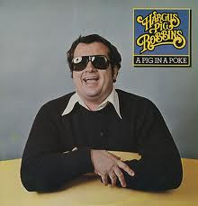

# A Pig In A Poke

By Hargus Robbins

## Album Data

[Discogs URL](https://www.discogs.com/release/3297255-Hargus-Pig-Robbins-A-Pig-In-A-Poke)

- Label: Elektra
- Formats: Vinyl, LP, Album
- Genres: Folk, World, & Country, Country, Bluegrass
- Rating: 3.75
- Released: 1978
- Year: 1978
- Release ID: 3297255
- Media condition: 
- Sleeve condition: 
- Speed: 
- Weight: 
- Notes: 

## Album Tracks

| **Position** | **Title** | **Duration** |
|--------------|-----------|--------------|
| A1 | **Alley Cat** | 2:23 |
| A2 | **Canadian Sunset** | 2:41 |
| A3 | **It Was Almost Like A Song** | 3:08 |
| A4 | **Roamin' 'Round** | 3:05 |
| A5 | **Don't It Make My Brown Eyes Blue** | 2:16 |
| B1 | **Little Bitty Pretty One** | 2:50 |
| B2 | **A Swingin' Safari** | 3:04 |
| B3 | **Forever** | 2:45 |
| B4 | **White Silver Sands** | 2:39 |
| B5 | **Blue Bayou** | 3:42 |

## Artist Roles

| **Name** | **Role** |
|----------|----------|
| **Ray Edenton** | Acoustic Guitar |
| **Hargus Robbins** | Arranged By |
| **Ron Coro** | Design |
| **Buddy Harman** | Drums |
| **Larrie Londin** | Drums |
| **Henry Strzelecki** | Electric Bass |
| **Rod Smarr** | Electric Guitar [Rhythm] |
| **Lou Bradley** | Engineer |
| **Johnny Gimble** | Fiddle |
| **Pete Wade** | Lead Guitar, Guitar [Gut String] |
| **Slick Lawson** | Photography By |
| **Hargus Robbins** | Producer |
| **Ken Laxton** | Remix |
| **Ronnie Reynolds** | Remix |
| **Lloyd Green** | Steel Guitar, Dobro |
| **Tony Migliore** | Synthesizer [Arp] |
| **Hargus Robbins** | Synthesizer, Clavinet, Baby Grand Piano |

