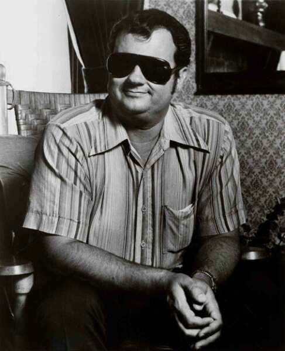

# Hargus Robbins

## Artist Profile

Robbins is a prominent session keyboardist and pianist in Nashville, Tennessee. Born January 18, 1938 in Spring City, Tennessee; died January 30, 2022. 
He is also blind, having lost his sight at age four due to an accident involving his father's knife. He learned to play piano at age seven, while attending the Nashville School for the Blind.
Between 1963 and 1979, Robbins also recorded eight studio albums: one on Time Records, three on Chart Records, and four on Elektra Records, as well as an independent live album
He is also known as Mel Robbins and Mel "Pig" Robbins.

## Artist Links

- [https://en.wikipedia.org/wiki/Hargus_%22Pig%22_Robbins](https://en.wikipedia.org/wiki/Hargus_%22Pig%22_Robbins)
- [https://www.imdb.com/name/nm4911969/](https://www.imdb.com/name/nm4911969/)

## See also

- [A Pig In A Poke](A_Pig_In_A_Poke.md)
