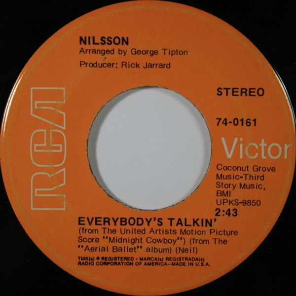

# Everybody's Talkin'

By Harry Nilsson

## Album Data

[Discogs URL](https://www.discogs.com/release/2201676-Nilsson-Everybodys-Talkin)

- Label: RCA Victor
- Formats: Vinyl, 7", 45 RPM, Single, Stereo
- Genres: Rock, Stage & Screen, Folk Rock, Power Pop
- Rating: 4.18
- Released: 1969
- Year: 1969
- Release ID: 2201676
- Media condition: 
- Sleeve condition: 
- Speed: 
- Weight: 
- Notes: 

## Album Tracks

| **Position** | **Title** | **Duration** |
|--------------|-----------|--------------|
| A | **Everybody's Talkin'** | 2:43 |
| B | **Rainmaker** | 2:33 |

## Artist Roles

| **Name** | **Role** |
|----------|----------|
| **Rick Jarrard** | Producer |

