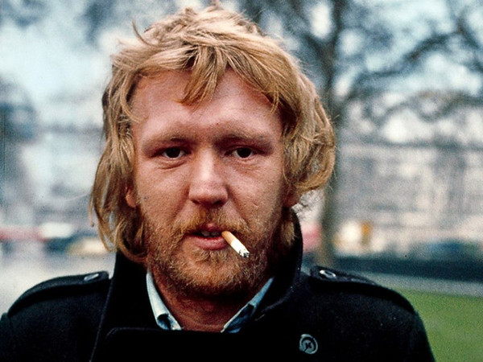

# Harry Nilsson

## Artist Profile

Harry Nilsson, who recorded mainly under his stage name Nilsson, was an American Grammy-awarded singer, piano player, songwriter, and actor, born June 15, 1941, in Bushwick, Kings County in Brooklyn, New York City. He died on January 15, 1994, in Agoura Hills, CA. His 3rd album, 'Aerial Ballet', is named after the art form his paternal grandparents from Sweden (who immigrated to the USA) performed at circuses.

## Artist Links

- [https://www.harrynilsson.com/](https://www.harrynilsson.com/)
- [https://en.wikipedia.org/wiki/Harry_Nilsson](https://en.wikipedia.org/wiki/Harry_Nilsson)
- [https://twitter.com/OfficialNilsson](https://twitter.com/OfficialNilsson)
- [https://www.facebook.com/harrynilsson/](https://www.facebook.com/harrynilsson/)
- [https://www.imdb.com/name/nm0632223/](https://www.imdb.com/name/nm0632223/)
- [https://www.youtube.com/channel/UCQKnnu5aXSVs4oMKvsDmi8Q](https://www.youtube.com/channel/UCQKnnu5aXSVs4oMKvsDmi8Q)
- [https://web.archive.org/web/20080617102728/http://www.nilssonschmilsson.com/harry-nilsson-biography.html](https://web.archive.org/web/20080617102728/http://www.nilssonschmilsson.com/harry-nilsson-biography.html)
- [https://www.findagrave.com/memorial/20967/harry-nilsson](https://www.findagrave.com/memorial/20967/harry-nilsson)

## See also

- [Everybody's Talkin'](Everybodys_Talkin.md)
- [Nilsson Schmilsson](Nilsson_Schmilsson.md)
- [Son Of Schmilsson](Son_Of_Schmilsson.md)
