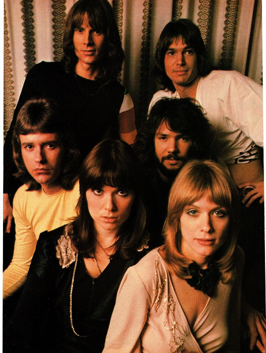

# Heart

## Artist Profile

Rock group that was started in Seattle, in 1967, as "The Army" by bassist Steve Fossen, along with Roger Fisher on guitar, Don Wilhelm on guitar, keyboards and lead vocals, and Ray Schaefer on drums.

Changed name to White Heart, then to Hocus Pocus shortly before Ann Wilson's joining in 1970, then finally to Heart in 1972. Nancy Wilson joined after sitting in and auditioning in 1974.

Members: Ann Wilson, Nancy Wilson, Craig Bartock, Andy Stoller, Dan Walker, Ryan Waters, Denny Fongheiser.

## Artist Links

- [https://www.heart-music.com/](https://www.heart-music.com/)
- [https://myspace.com/heart](https://myspace.com/heart)
- [https://en.wikipedia.org/wiki/Heart_(band)](https://en.wikipedia.org/wiki/Heart_(band))
- [https://www.facebook.com/heart](https://www.facebook.com/heart)
- [https://twitter.com/officialheart](https://twitter.com/officialheart)
- [https://www.youtube.com/c/thebandheart/](https://www.youtube.com/c/thebandheart/)
- [https://www.instagram.com/heartofficial/](https://www.instagram.com/heartofficial/)
- [https://linktr.ee/Officialheart](https://linktr.ee/Officialheart)

## See also

- [Dog & Butterfly](Dog_and_Butterfly.md)
- [Dreamboat Annie](Dreamboat_Annie.md)
- [Little Queen](Little_Queen.md)
- [Magazine](Magazine.md)
