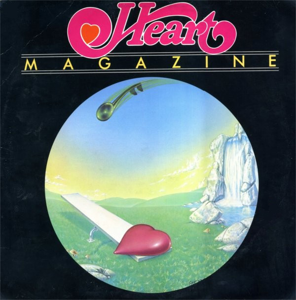

# Magazine

By Heart

## Album Data

[Discogs URL](https://www.discogs.com/release/412737-Heart-Magazine)

- Label: Mushroom Records (5)
- Formats: Vinyl, LP, Album, Reissue
- Genres: Rock, Folk Rock, Hard Rock, Classic Rock
- Rating: 3.71
- Released: 1978
- Year: 1977
- Release ID: 412737
- Media condition: 
- Sleeve condition: 
- Speed: 
- Weight: 
- Notes: 

## Album Tracks

| **Position** | **Title** | **Duration** |
|--------------|-----------|--------------|
| A1 | **Heartless** | 4:59 |
| A2 | **Devil Delight** | 4:58 |
| A3 | **Just The Wine** | 4:15 |
| A4 | **Without You** | 4:43 |
| B1 | **Magazine** | 6:19 |
| B2 | **Here Song** | 1:34 |
| B3 | **Mother Earth Blues** | 5:42 |
| B4 | **I've Got The Music In Me** | 6:01 |

## Artist Roles

| **Name** | **Role** |
|----------|----------|
| **Nancy Wilson (2)** | Acoustic Guitar, Electric Guitar, Blues Harp, Vocals |
| **Howard Leese** | Arranged By [Strings], Conductor [Strings] |
| **Loren Salazar** | Artwork [Front Cover] |
| **Steve Fossen** | Bass, Vocals |
| **Michael Derosier** | Drums |
| **Mike Flicker** | Engineer |
| **Rick Keefer** | Engineer |
| **Larry Green (3)** | Engineer [Assistant Engineer] |
| **Rolf Hennemann** | Engineer [Assistant Engineer] |
| **Terry Gottlieb** | Engineer [Assistant Engineer] |
| **Howard Leese** | Guitar, Keyboards, Vocals |
| **John Golden** | Lacquer Cut By |
| **Roger Fisher (2)** | Lead Guitar |
| **Ann Wilson** | Lead Vocals, Flute, Acoustic Guitar |
| **Ann Wilson** | Lyrics By |
| **Nancy Wilson (2)** | Lyrics By |
| **Ken Kinnear** | Management |
| **Mike Flicker** | Producer |
| **Heart** | Producer [Production Assistance] |
| **Mike Fisher (2)** | Producer [Production Assistance] |
| **Mike Fisher (2)** | Producer [Special Direction] |

