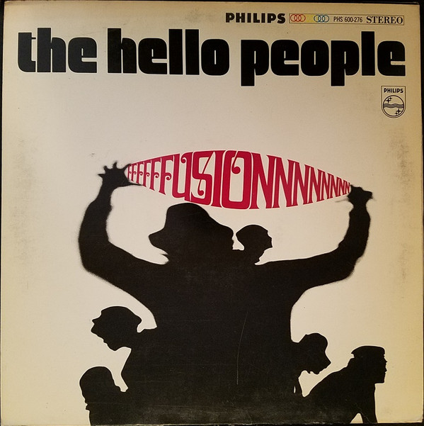

# Fusion

By Hello People

## Album Data

[Discogs URL](https://www.discogs.com/release/3037337-The-Hello-People-Fusion)

- Label: Philips
- Formats: Vinyl, LP, Album
- Genres: Rock, Psychedelic Rock
- Rating: 3.97
- Released: 1968
- Year: 1968
- Release ID: 3037337
- Media condition: 
- Sleeve condition: 
- Speed: 
- Weight: 
- Notes: 

## Album Tracks

| **Position** | **Title** | **Duration** |
|--------------|-----------|--------------|
| A1 | **White Winged Doves** | 4:11 |
| A2 | **Anthem** | 4:01 |
| A3 | **Jelly Jam** | 4:00 |
| A4 | **If I Should Sing Too Softly** | 3:16 |
| A5 | **How Does It Feel To Be Free** | 3:41 |
| B1 | **Pray For Rain** | 2:53 |
| B2 | **A Dream Of Tomorrow** | 4:18 |
| B3 | **Everything's Better** | 3:17 |
| B4 | **Come And See Me** | 6:38 |
| B5 | **I Ride To Nowhere** | 3:06 |

## Artist Roles

| **Name** | **Role** |
|----------|----------|
| **Lew Futterman** | Producer |
| **Bill Szymczyk** | Recorded By [Sound Recording] |
| **Hal Dreeben** | Recorded By [Sound Recording] |
| **Pete Weiss (2)** | Recorded By [Sound Recording] |
| **Stu Black** | Recorded By [Sound Recording] |
| **Hello People** | Vocals, Instrumentation By, Arranged By |

