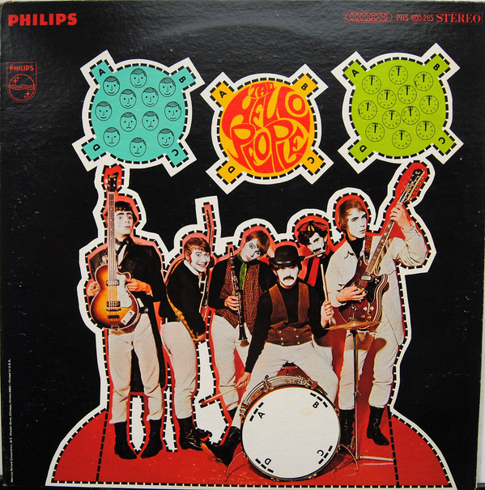

# The Hello People

By Hello People

## Album Data

[Discogs URL](https://www.discogs.com/release/2529835-The-Hello-People-The-Hello-People)

- Label: Philips
- Formats: Vinyl, LP, Album, Stereo
- Genres: Rock, Psychedelic Rock, Pop Rock
- Rating: 3.69
- Released: 1968
- Year: 1968
- Release ID: 2529835
- Media condition: 
- Sleeve condition: 
- Speed: 
- Weight: 
- Notes: 

## Album Tracks

| **Position** | **Title** | **Duration** |
|--------------|-----------|--------------|
| A1 | **It's A Monday Kind Of Tuesday** | 3:28 |
| A2 | **Sunrise Meadow** | 5:15 |
| A3 | **A Stranger At Her Door** | 3:42 |
| A4 | **Movin' And Growin'** | 3:37 |
| B1 | **Paisley Teddy Bear** | 2:45 |
| B2 | **(As I Went Down To) Jerusalem** | 4:10 |
| B3 | **Lamplight, Nightlight** | 4:30 |
| B4 | **Mr. Truth Evading, Masquerading Man** | 2:20 |
| B5 | **Paris In The Rain** | 4:51 |

## Artist Roles

| **Name** | **Role** |
|----------|----------|
| **Hello People** | Arranged By, Effects [Vocal Instrumental] |
| **Raymond Ross** | Photography By [B&w] |
| **Bert Andrews** | Photography By [Cover] |
| **Lew Futterman** | Producer |

