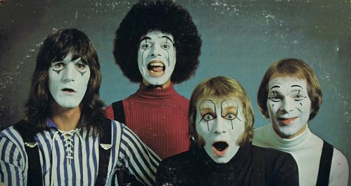

# Hello People

## Artist Profile

Rock group that was created in New York City, USA in 1967 by producer Lew Futterman. Active to the late 1970s.

## Artist Links

- [http://www.thecoolgroove.com/hello.html](http://www.thecoolgroove.com/hello.html)
- [https://en.wikipedia.org/wiki/Hello_People](https://en.wikipedia.org/wiki/Hello_People)

## See also

- [Bricks](Bricks.md)
- [Fusion](Fusion.md)
- [The Handsome Devils](The_Handsome_Devils.md)
- [The Hello People](The_Hello_People.md)
