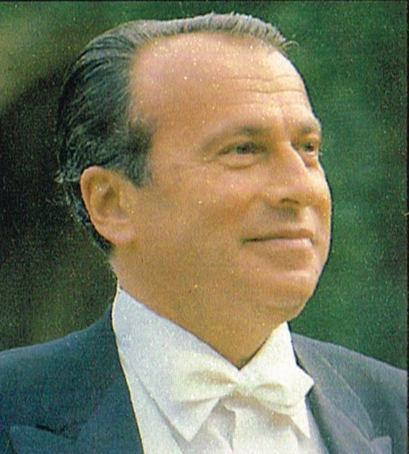

# Henryk Szeryng

## Artist Profile

Mexican-Polish violinist, born September 22, 1918, in Żelazowa Wola, Poland, considered "one of the more elegant representatives of a now fading school of Romantic violin" (NYT, March 4, 1988). He became naturalised Mexican citizen in 1946 and died on tour on March 3, 1988, in Kassel, Germany.

## Artist Links

- [https://en.wikipedia.org/wiki/Henryk_Szeryng](https://en.wikipedia.org/wiki/Henryk_Szeryng)
- [http://www.henrykszeryng.net](http://www.henrykszeryng.net)
- [http://www.thirteen.org/publicarts/violin/szeryng.html](http://www.thirteen.org/publicarts/violin/szeryng.html)

## See also

- [Violin Concerto](Violin_Concerto.md)
