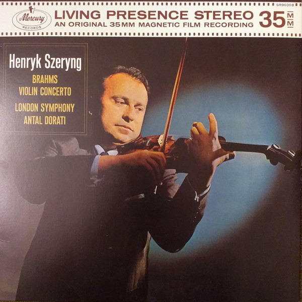

# Violin Concerto

By Henryk Szeryng

## Album Data

[Discogs URL](https://www.discogs.com/release/4121140-Henryk-Szeryng-Brahms-London-Symphony-Antal-Dorati-Violin-Concerto)

- Label: Decca
Mercury Living Presence
Mercury
- Formats: Vinyl, LP, Reissue, Remastered, Stereo
- Genres: Classical, Romantic
- Rating: 4.89
- Released: 2016-07-01
- Year: 1962
- Release ID: 4121140
- Media condition: 
- Sleeve condition: 
- Speed: 
- Weight: 
- Notes: 

## Album Tracks

| **Position** | **Title** | **Duration** |
|--------------|-----------|--------------|
|  | **Violin Concerto In D Major, Opus 77** |  |

## Artist Roles

| **Name** | **Role** |
|----------|----------|
| **Johannes Brahms** | Composed By |
| **Antal Dorati** | Conductor |
| **George Maas** | Design [Cover] |
| **The London Symphony Orchestra** | Orchestra |
| **Angus McBean** | Photography By [Cover] |
| **Harold Lawrence** | Producer |
| **James Lyons** | Sleeve Notes |
| **Henryk Szeryng** | Violin |

