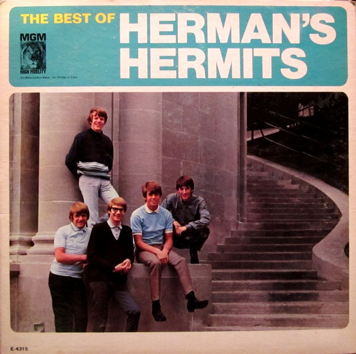

# The Best Of Herman's Hermits

By Herman's Hermits

## Album Data

[Discogs URL](https://www.discogs.com/release/1583551-Hermans-Hermits-The-Best-Of-Hermans-Hermits)

- Label: MGM Records
MGM Records
- Formats: Vinyl, LP, Compilation, Mono
- Genres: Rock, Pop Rock
- Rating: 3.71
- Released: 1965
- Year: 1965
- Release ID: 1583551
- Media condition: 
- Sleeve condition: 
- Speed: 
- Weight: 
- Notes: 

## Album Tracks

| **Position** | **Title** | **Duration** |
|--------------|-----------|--------------|
| A1 | **I'm Henry VIII, I Am** | 1:49 |
| A2 | **Mrs. Brown You've Got A Lovely Daughter** | 2:46 |
| A3 | **Mother-In-Law** | 2:21 |
| A4 | **I'm Into Something Good** | 2:31 |
| A5 | **Silhouettes** | 1:57 |
| B1 | **Just A Little Bit Better** | 2:57 |
| B2 | **Can't You Hear My Heartbeat** | 2:15 |
| B3 | **The End Of The World** | 2:57 |
| B4 | **Sea Cruise** | 2:08 |
| B5 | **I Gotta Dream On** | 2:04 |
| B6 | **Wonderful World** | 1:57 |

## Artist Roles

| **Name** | **Role** |
|----------|----------|
| **Acy Lehman** | Design Concept |
| **Val Valentin** | Engineer [Director Of Engineering] |
| **June Harris** | Liner Notes |
| **William Claxton** | Photography By  [Back Cover] |
| **Rama (11)** | Photography By  [Front Cover] |
| **Mickie Most** | Producer |

