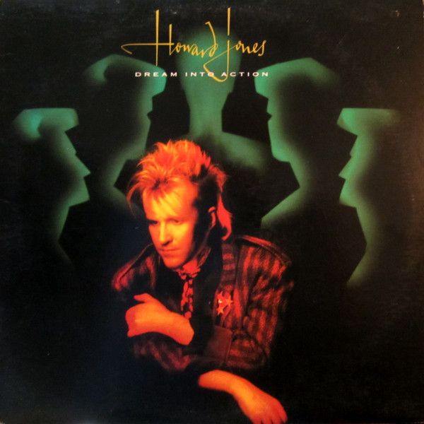

# Dream Into Action

By Howard Jones

## Album Data

[Discogs URL](https://www.discogs.com/release/5498431-Howard-Jones-Dream-Into-Action)

- Label: Elektra
Elektra
- Formats: Vinyl, LP, Album, Stereo
- Genres: Electronic, Synth-pop
- Rating: 3.92
- Released: 1985
- Year: 1985
- Release ID: 5498431
- Media condition: 
- Sleeve condition: 
- Speed: 
- Weight: 
- Notes: 

## Album Tracks

| **Position** | **Title** | **Duration** |
|--------------|-----------|--------------|
| A1 | **Things Can Only Get Better** | 4:02 |
| A2 | **Life In One Day** | 3:39 |
| A3 | **No One Is To Blame** | 3:28 |
| A4 | **Dream Into Action** | 3:45 |
| A5 | **Like To Get To Know You Well** | 3:59 |
| A6 | **Assault And Battery** | 4:51 |
| B1 | **Look Mama** | 3:53 |
| B2 | **Bounce Right Back** | 3:55 |
| B3 | **Elegy** | 4:20 |
| B4 | **Is There A Difference?** | 3:33 |
| B5 | **Automaton** | 4:04 |
| B6 | **Hunger For The Flesh** | 3:54 |

## Artist Roles

| **Name** | **Role** |
|----------|----------|
| **Rob O'Connor** | Artwork [Graphic Design] |
| **Stylorouge** | Artwork [Graphic Design] |
| **Hojo Kurosawa** | Artwork [Human Models] |
| **Howard Jones** | Music By, Lyrics By, Vocals, Instruments, Programmed By |
| **Caron Wheeler** | Performer [Afrodiziak Are] |
| **Claudia Fontaine** | Performer [Afrodiziak Are] |
| **Naomi Thompson** | Performer [Afrodiziak Are] |
| **Elizabeth Holden** | Performer [The Effervescents Are] |
| **Kirstie Fulthorpe** | Performer [The Effervescents Are] |
| **Laura Bishop (2)** | Performer [The Effervescents Are] |
| **Tania Matos** | Performer [The Effervescents Are] |
| **Alan Whetton** | Performer [The Tko Horns Are] |
| **Brian Maurice** | Performer [The Tko Horns Are] |
| **Dave Plews** | Performer [The Tko Horns Are] |
| **Jim Paterson** | Performer [The Tko Horns Are] |
| **Simon Fowler (2)** | Photography By [Album Sleeve] |
| **Rupert Hine** | Producer |
| **Andrew Scarth** | Recorded By [Assistant] |
| **Stephen W. Tayler** | Recorded By, Mixed By |

