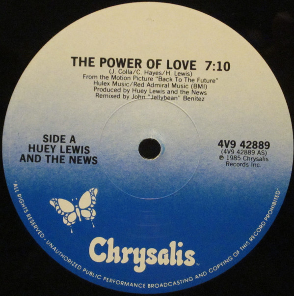

# The Power Of Love

By Huey Lewis & The News

## Album Data

[Discogs URL](https://www.discogs.com/release/8445706-Huey-Lewis-And-The-News-The-Power-Of-Love)

- Label: Chrysalis
Chrysalis
- Formats: Vinyl, 7", 45 RPM, Single, Styrene
- Genres: Rock, Pop Rock
- Rating: 3.33
- Released: 1985
- Year: 1985
- Release ID: 8445706
- Media condition: 
- Sleeve condition: 
- Speed: 
- Weight: 
- Notes: 

## Album Tracks

| **Position** | **Title** | **Duration** |
|--------------|-----------|--------------|
| A | **The Power Of Love** | 3:53 |
| B | **Bad Is Bad** | 3:46 |

## Artist Roles

| **Name** | **Role** |
|----------|----------|
| **Huey Lewis & The News** | Producer |

