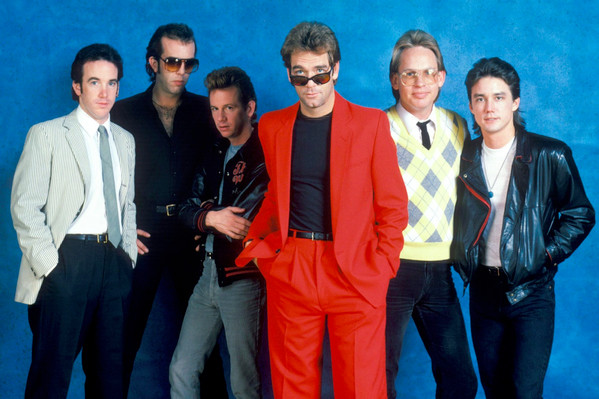

# Huey Lewis & The News

## Artist Profile

Formed: 1978 // Corte Madera, CA, United States 
Members:
Huey Lewis (lead vocals, harmonica)
Johnny Colla (saxophone, guitar, vocals)
Bill Gibson (percussion, vocals)
John Pierce (bass) 1995 - 
Sean Hopper (keyboards, vocals)
Stef Burns (lead guitar, vocals) 2000 - 
"The News Brothers" 1994 - 
Marvin McFadden (trumpet)
Rob Sudduth (tenor & baritone saxophone) 

Former members:
Mario Cipollina (bass, vocals) 1979 - 1995
Chris Hayes (lead guitar, vocals) 1979 - 2000
Ron Stallings (tenor saxophone) 1994 - 2009

## Artist Links

- [http://www.hueylewisandthenews.com/](http://www.hueylewisandthenews.com/)
- [https://en.wikipedia.org/wiki/Huey_Lewis_and_the_News](https://en.wikipedia.org/wiki/Huey_Lewis_and_the_News)
- [https://myspace.com/hueylewisthenews](https://myspace.com/hueylewisthenews)
- [https://myspace.com/hueylewisandthenewsmusic](https://myspace.com/hueylewisandthenewsmusic)
- [https://www.facebook.com/hueylewisandthenews/](https://www.facebook.com/hueylewisandthenews/)
- [https://twitter.com/Huey_Lewis_News](https://twitter.com/Huey_Lewis_News)

## See also

- [The Power Of Love](The_Power_Of_Love.md)
