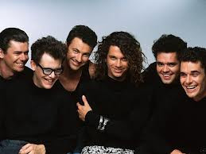

# INXS

## Artist Profile

INXS were an Australian rock band, formed in 1977 in Sydney, New South Wales. The group disbanded on 11 November 2012.

Members: 
Michael Hutchence (vocals, 1977-November 22, 1997)
Andrew Farriss (keyboards, guitar)
Tim Farriss (guitar)
Kirk Pengilly (saxophone, guitar, vocals)
Garry Gary Beers (bass, vocals)
Jon Farriss (drums)
Jimmy Barnes (vocals, 1998)
Terence Trent D'Arby (vocals, 1999)
Jon Stevens (vocals, 2000-2003)
J.D. Fortune (vocals, 2005-2008, 2010-August 14, 2011)
Ciaran Gribbin (vocals, September 2011-November 2012)

## Artist Links

- [http://www.inxs.com](http://www.inxs.com)
- [http://www.facebook.com/inxs](http://www.facebook.com/inxs)
- [http://www.imdb.com/name/nm0409482](http://www.imdb.com/name/nm0409482)
- [http://inxsweb.com/discography](http://inxsweb.com/discography)
- [http://www.myspace.com/inxs](http://www.myspace.com/inxs)
- [https://twitter.com/INXS](https://twitter.com/INXS)
- [http://en.wikipedia.org/wiki/INXS](http://en.wikipedia.org/wiki/INXS)
- [http://www.youtube.com/user/inxsofficial](http://www.youtube.com/user/inxsofficial)
- [http://www.youtube.com/user/INXSVEVO](http://www.youtube.com/user/INXSVEVO)

## See also

- [Listen Like Thieves](Listen_Like_Thieves.md)
