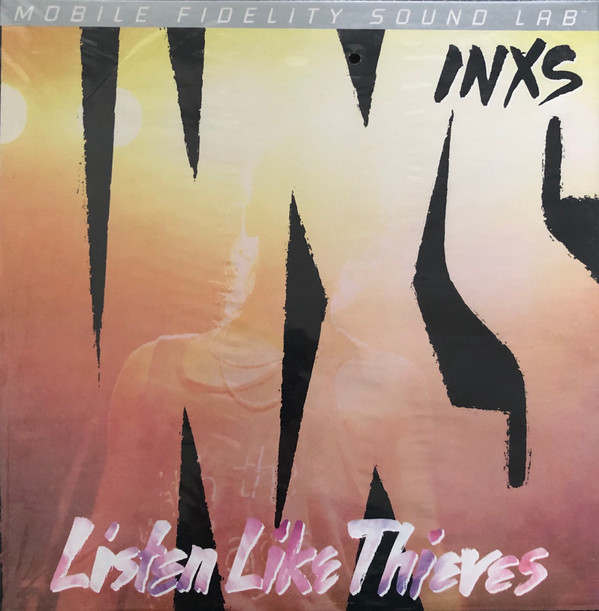

# Listen Like Thieves

By INXS

## Album Data

[Discogs URL](https://www.discogs.com/release/4721426-INXS-Listen-Like-Thieves)

- Label: Mobile Fidelity Sound Lab
- Formats: Vinyl, LP, Album, Limited Edition, Numbered, Reissue, Remastered, Stereo
- Genres: Electronic, Rock, Pop, New Wave, Pop Rock, Synth-pop
- Rating: 4.33
- Released: 2013
- Year: 1985
- Release ID: 4721426
- Media condition: 
- Sleeve condition: 
- Speed: 
- Weight: 
- Notes: 

## Album Tracks

| **Position** | **Title** | **Duration** |
|--------------|-----------|--------------|
| A1 | **What You Need** |  |
| A2 | **Listen Like Thieves** |  |
| A3 | **Kiss The Dirt (Falling Down The Mountain)** |  |
| A4 | **Shine Like It Does** |  |
| A5 | **Good And Bad Times** |  |
| B1 | **Biting Bullets** |  |
| B2 | **This Time** |  |
| B3 | **Three Sisters** |  |
| B4 | **Same Direction** |  |
| B5 | **One X One** |  |
| B6 | **Red Red Sun** |  |

