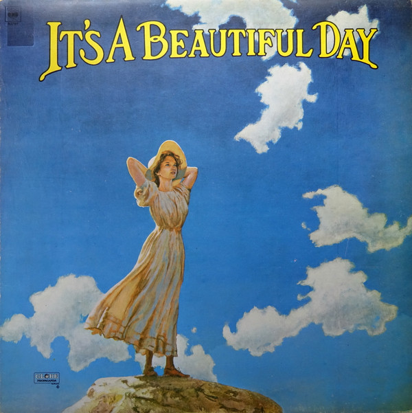

# It's A Beautiful Day

By It's A Beautiful Day

## Album Data

[Discogs URL](https://www.discogs.com/release/2605730-Its-A-Beautiful-Day-Its-A-Beautiful-Day)

- Label: Columbia
- Formats: Vinyl, LP, Album, Reissue
- Genres: Rock, Psychedelic Rock
- Rating: 4.14
- Released: 1970
- Year: 1969
- Release ID: 2605730
- Media condition: 
- Sleeve condition: 
- Speed: 
- Weight: 
- Notes: 

## Album Tracks

| **Position** | **Title** | **Duration** |
|--------------|-----------|--------------|
| A1 | **White Bird** | 6:06 |
| A2 | **Hot Summer Day** | 5:46 |
| A3 | **Wasted Union Blues** | 4:00 |
| A4 | **Girl With No Eyes** | 3:49 |
| B1 | **Bombay Calling** | 4:25 |
| B2 | **Bulgaria** | 6:10 |
| B3 | **Time Is** | 9:42 |

## Artist Roles

| **Name** | **Role** |
|----------|----------|
| **Mitchell Holman** | Bass |
| **Val Fuentes** | Drums |
| **Brian Ross-Myring** | Engineer |
| **Hal Wagenet** | Guitar |
| **Bruce Steinberg** | Harmonica |
| **Linda Laflamme** | Organ, Piano, Electric Piano, Celesta, Harpsichord |
| **Bruce Steinberg** | Photography [Center And Back Cover] |
| **David Laflamme** | Producer |
| **David Laflamme** | Violin, Vocals |
| **Pattie Santos** | Vocals, Tambourine, Bells, Percussion [Block, Gourd] |

