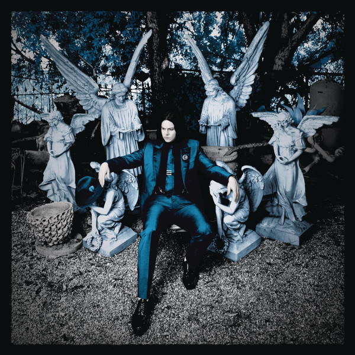

# Lazaretto

By Jack White

## Album Data

[Discogs URL](https://www.discogs.com/release/5764967-Jack-White-Lazaretto)

- Label: Third Man Records
- Formats: Vinyl, LP, Album, Etched
- Genres: Rock, Alternative Rock, Blues Rock, Country Rock
- Rating: 4.18
- Released: 2014-06-10
- Year: 2014
- Release ID: 5764967
- Media condition: 
- Sleeve condition: 
- Speed: 
- Weight: 
- Notes: 

## Album Tracks

| **Position** | **Title** | **Duration** |
|--------------|-----------|--------------|
| A1 | **Three Women** | 3:56 |
| A2 | **Lazaretto** | 3:40 |
| A3 | **Temporary Ground** | 3:13 |
| A4 | **Would You Fight For My Love?** | 4:10 |
| A5 | **High Ball Stepper** | 3:45 |
| A6 | **Untitled** |  |
| A7 | **Untitled** | 0:56 |
| BA1 | **Just One Drink** | 2:40 |
| BB1 | **Just One Drink** | 2:37 |
| B2 | **Alone In My Home** | 3:30 |
| B3 | **That Black Bat Licorice** | 3:52 |
| B4 | **Entitlement** | 4:06 |
| B5 | **I Think I Found The Culprit** | 3:51 |
| B6 | **Want And Able** | 2:34 |
| B7 | **Untitled** |  |
| B8 | **Untitled** | 0:44 |

## Artist Roles

| **Name** | **Role** |
|----------|----------|
| **Tristan Duke** | Artwork [Hologram Track] |
| **Jack White (2)** | Design, Layout |
| **Nathanio Strimpopulos** | Design, Layout |
| **Lars Fox** | Edited By [Additional] |
| **Ian Montone** | Management |
| **Bob Ludwig** | Mastered By |
| **Jack White (2)** | Mixed By |
| **Joshua V. Smith** | Mixed By |
| **Mary Ellen Matthews** | Photography By |
| **Lewis Hine** | Photography By [Additional] |
| **Jack White (2)** | Producer |
| **Joshua V. Smith** | Recorded By |
| **Vance Powell** | Recorded By |
| **Joshua V. Smith** | Recorded By [Assistant] |
| **Mindy Watts** | Recorded By [Assistant] |
| **Blind Willie McTell** | Written-By |
| **Jack White (2)** | Written-By |

