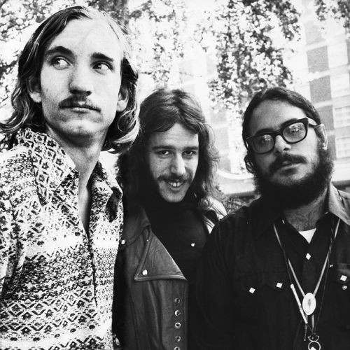

# James Gang

## Artist Profile

The James Gang was an American rock band formed in Cleveland, Ohio in 1966, and was the first band that Joe Walsh of the Eagles fronted. The group disbanded in 1977, however from the 1990s onwards the group reformed a number of times, most recently in 2022.

## Artist Links

- [http://buckeyebeat.com/jamesgang.html](http://buckeyebeat.com/jamesgang.html)
- [https://en.wikipedia.org/wiki/James_Gang](https://en.wikipedia.org/wiki/James_Gang)

## See also

- [Thirds](Thirds.md)
