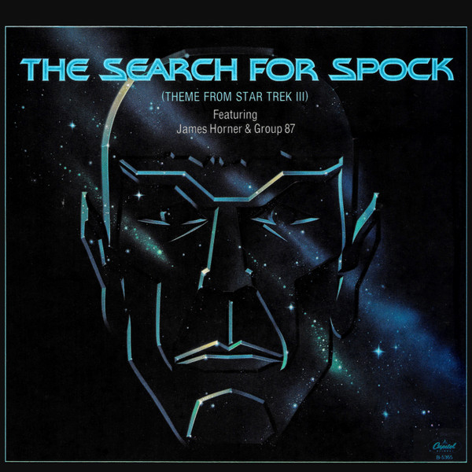

# The Search For Spock (Theme From "Star Trek III")

By James Horner

## Album Data

[Discogs URL](https://www.discogs.com/release/3280851-James-Horner-Group-87-The-Search-For-Spock-Theme-From-Star-Trek-III)

- Label: Capitol Records
- Formats: Vinyl, 7", 45 RPM, Single
- Genres: Electronic, Pop, Stage & Screen, Score
- Rating: 5
- Released: 1984
- Year: 1984
- Release ID: 3280851
- Media condition: 
- Sleeve condition: 
- Speed: 
- Weight: 
- Notes: 

## Album Tracks

| **Position** | **Title** | **Duration** |
|--------------|-----------|--------------|
| A | **The Search For Spock (Theme From "Star Trek III")** | 3:40 |
| B | **Returning To Vulcan** | 4:49 |

## Artist Roles

| **Name** | **Role** |
|----------|----------|
| **James Horner** | Composed By [Theme] |

