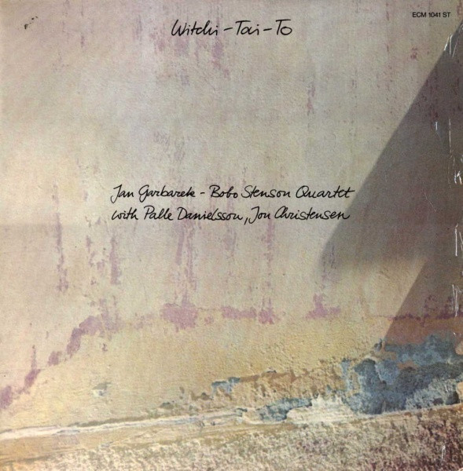

# Witchi-Tai-To

By Jan Garbarek - Bobo Stenson Quartet

## Album Data

[Discogs URL](https://www.discogs.com/release/374628-Jan-Garbarek-Bobo-Stenson-Quartet-With-Palle-Danielsson-Jon-Christensen-Witchi-Tai-To)

- Label: ECM Records
- Formats: Vinyl, LP, Album
- Genres: Jazz, Contemporary Jazz
- Rating: 4.41
- Released: 1974
- Year: 1974
- Release ID: 374628
- Media condition: 
- Sleeve condition: 
- Speed: 
- Weight: 
- Notes: 

## Album Tracks

| **Position** | **Title** | **Duration** |
|--------------|-----------|--------------|
| A1 | **A. I. R.** | 8:15 |
| A2 | **Kukka** | 4:32 |
| A3 | **Hasta Siempre** | 8:10 |
| B1 | **Witchi-Tai-To** | 4:24 |
| B2 | **Desireless** | 20:25 |

## Artist Roles

| **Name** | **Role** |
|----------|----------|
| **B & B Wojirsch** | Design [Cover Design] |
| **Palle Danielsson** | Double Bass |
| **Jon Christensen** | Drums |
| **Jan Erik Kongshaug** | Engineer |
| **Paul Maar** | Photography By [Cover Photo] |
| **Bobo Stenson** | Piano |
| **Manfred Eicher** | Producer [Produced By] |
| **Jan Garbarek** | Soprano Saxophone, Tenor Saxophone |

