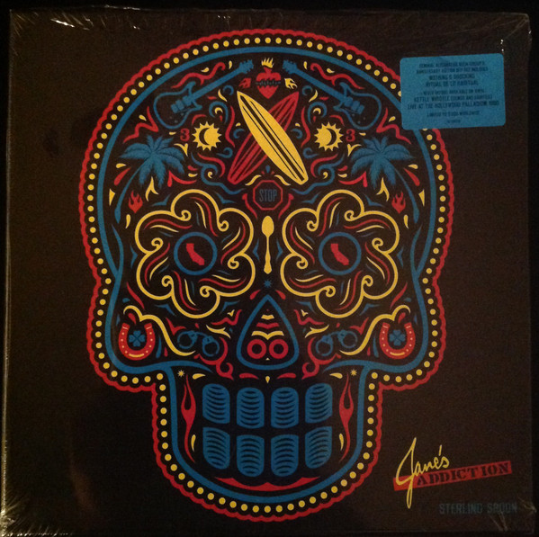

# Sterling Spoon 

By Jane's Addiction

## Album Data

[Discogs URL](https://www.discogs.com/release/9233585-Janes-Addiction-Sterling-Spoon-)

- Label: Rhino Records (2)
- Formats: Vinyl
Vinyl
Vinyl
Vinyl
Box Set, LP, Album, Reissue, LP, Album, Reissue, LP, Album, Reissue, LP, Album, Compilation, Limited Edition
- Genres: Rock, Alternative Rock, Hard Rock
- Rating: 4.74
- Released: 2016-10-21
- Year: 2016
- Release ID: 9233585
- Media condition: 
- Sleeve condition: 
- Speed: 
- Weight: 
- Notes: 

## Album Tracks

| **Position** | **Title** | **Duration** |
|--------------|-----------|--------------|
|  | **Nothing's Shocking** |  |
| A1 | **Up The Beach** | 3:02 |
| A2 | **Ocean Size** | 4:20 |
| A3 | **Had A Dad** | 3:49 |
| A4 | **Ted, Just Admit It...** | 7:19 |
| A5 | **Standing In The Shower... Thinking** | 3:05 |
| B1 | **Summertime Rolls** | 6:20 |
| B2 | **Mountain Song** | 4:04 |
| B3 | **Idiots Rule** | 3:01 |
| B4 | **Jane Says** | 4:53 |
| B5 | **Thank You Boys** | 1:05 |
|  | **Ritual De Lo Habitual** |  |
| C1 | **Stop!** | 4:14 |
| C2 | **No One's Leaving** | 3:01 |
| C3 | ** Ain't No Right** | 3:30 |
| D1 | **Obvious** | 5:58 |
| D2 | **Been Caught Stealing** | 3:33 |
| E1 | **Three Days** | 10:45 |
| E2 | **Then She Did...** | 8:19 |
| F1 | **Of Course** | 7:02 |
| F2 | **Classic Girl** | 5:10 |
|  | **Kettle Whistle Extracts** |  |
| G1 | **Kettle Whistle** | 7:47 |
| G2 | **Ocean Size (Demo Version)** | 4:32 |
| G3 | **My Cat's Name Is Maceo (Demo)** | 4:23 |
| H1 | **Had A Dad (Studio Out-Take)** | 3:46 |
| H2 | **So What!** | 4:42 |
| H3 | **Mountain Song (Demo Version)** | 4:08 |
| H4 | **Been Caught Stealing (Studio Out-Take)** | 4:20 |
| H5 | **City (Soul Kiss 88)** | 2:30 |
|  | **Live At The Hollywood Palladium 1990** |  |
| I1 | **Drum Intro ** | 3:12 |
| I2 | **Up The Beach ** | 3:05 |
| I3 | **Whores** | 3:48 |
| I4 | **1** |   |
| I5 | **No One's Leaving** | 3:13 |
| J1 | **Ain't No Right ** | 2:41 |
| J2 | **Then She Did... ** | 10:01 |
| J3 | **Had A Dad ** | 5:00 |
| K1 | **Been Caught Stealing ** | 4:18 |
| K2 | **Three Days ** | 11:46 |
| L1 | **Mountain Song ** | 4:04 |
| L2 | **Stop! ** | 4:22 |
| L3 | **Summertime Rolls ** | 7:59 |
| L4 | **Ocean Size ** | 4:39 |

## Artist Roles

| **Name** | **Role** |
|----------|----------|
| **Ernesto Yerena** | Artwork |
| **Ian Sefchick** | Lacquer Cut By |
| **Dave Jerden** | Producer |
| **Jane's Addiction** | Producer |
| **Perry Farrell** | Producer |

