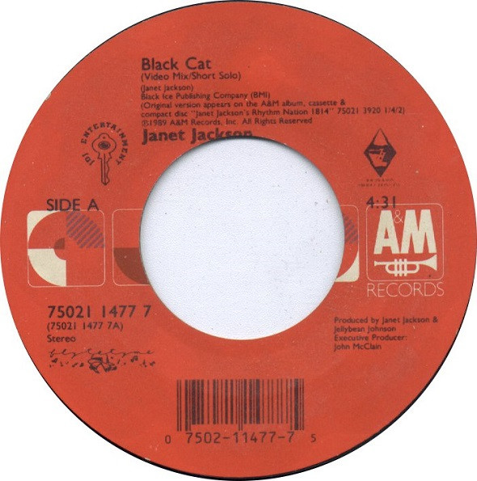

# Black Cat

By Janet Jackson

## Album Data

[Discogs URL](https://www.discogs.com/release/2871224-Janet-Jackson-Black-Cat)

- Label: A&M Records
- Formats: Vinyl, 7", 45 RPM, Single, Styrene
- Genres: Rock, Funk / Soul, Pop Rock, Funk
- Rating: 4.89
- Released: 1990
- Year: 1990
- Release ID: 2871224
- Media condition: 
- Sleeve condition: 
- Speed: 
- Weight: 
- Notes: 

## Album Tracks

| **Position** | **Title** | **Duration** |
|--------------|-----------|--------------|
| A | **Black Cat (Video Mix/Short Solo)** | 4:31 |
| B | **Black Cat** | 4:48 |

## Artist Roles

| **Name** | **Role** |
|----------|----------|
| **John McClain** | Executive-Producer |
| **Janet Jackson** | Producer |
| **Jellybean Johnson** | Producer |
| **Janet Jackson** | Written-By |

