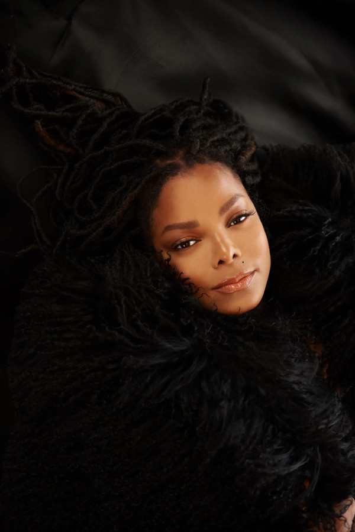

# Janet Jackson

## Artist Profile

American recording artist and actress, born 16 May 1966 in Gary, Indiana, USA.
Daughter of Joe Jackson (5), sister of Michael Jackson, Jermaine Jackson, Jackie Jackson, Tito Jackson, Marlon Jackson, Randy Jackson, Rebbie Jackson and La Toya Jackson.

Having sold over 100 million records, Jackson is one of the world's best-selling music artists. She has amassed an extensive catalog, with singles such as "Nasty", "Rhythm Nation", "That's the Way Love Goes", "Together Again", and "All for You"; she holds the record for the most consecutive top-ten entries on the US Billboard Hot 100 singles chart with 18. In 2019, she was inducted to the Rock and Roll Hall of Fame.

## Artist Links

- [http://www.janetjackson.com](http://www.janetjackson.com)
- [http://www.facebook.com/JanetJackson](http://www.facebook.com/JanetJackson)
- [http://www.onamrecords.com/artists/janet-jackson](http://www.onamrecords.com/artists/janet-jackson)
- [http://instagram.com/janetjackson](http://instagram.com/janetjackson)
- [http://www.myspace.com/janetjackson](http://www.myspace.com/janetjackson)
- [http://www.pinterest.com/janetjackson](http://www.pinterest.com/janetjackson)
- [http://www.soundcloud.com/janetjackson](http://www.soundcloud.com/janetjackson)
- [http://janetjackson.tumblr.com](http://janetjackson.tumblr.com)
- [http://twitter.com/JanetJackson](http://twitter.com/JanetJackson)
- [http://www.vimeo.com/janetjackson](http://www.vimeo.com/janetjackson)
- [http://www.whosampled.com/Janet-Jackson](http://www.whosampled.com/Janet-Jackson)
- [http://en.wikipedia.org/wiki/Janet_Jackson](http://en.wikipedia.org/wiki/Janet_Jackson)
- [http://www.youtube.com/user/JanetJacksonVEVO](http://www.youtube.com/user/JanetJacksonVEVO)

## See also

- [Black Cat](Black_Cat.md)
- [Come Give Your Love To Me](Come_Give_Your_Love_To_Me.md)
