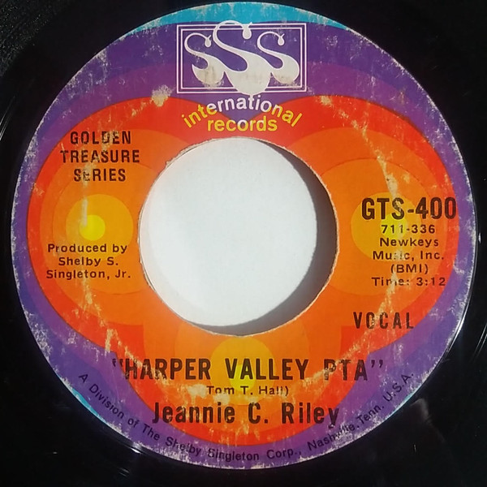

# Harper Valley P.T.A.

By Jeannie C. Riley

## Album Data

[Discogs URL](https://www.discogs.com/release/1524091-Jeannie-C-Riley-Harper-Valley-PTA)

- Label: Plantation Records
Plantation Records
- Formats: Vinyl, LP, Album
- Genres: Folk, World, & Country, Country
- Rating: 3.66
- Released: 1968
- Year: 1968
- Release ID: 1524091
- Media condition: 
- Sleeve condition: 
- Speed: 
- Weight: 
- Notes: 

## Album Tracks

| **Position** | **Title** | **Duration** |
|--------------|-----------|--------------|
| A1 | **Harper Valley P.T.A.** | 3:12 |
| A2 | **Widow Jones** | 2:42 |
| A3 | **No Brass Band** | 2:25 |
| A4 | **Mr. Harper** | 2:07 |
| A5 | **Run Jeannie Run** | 3:22 |
| A6 | **Shed Me No Tears** | 2:20 |
| B1 | **The Cotton Patch** | 3:40 |
| B2 | **Sippin' Shirley Thompson** | 2:02 |
| B3 | **The Little Town Square** | 2:10 |
| B4 | **The Ballad Of Louise** | 2:51 |
| B5 | **Satan Place** | 3:20 |

## Artist Roles

| **Name** | **Role** |
|----------|----------|
| **Southern Album Service** | Design [Album] |
| **Jerry Kennedy** | Dobro [Dobro Picking] |
| **Bill Forshee** | Photography By |
| **Shelby S Singleton Jr.** | Producer |

