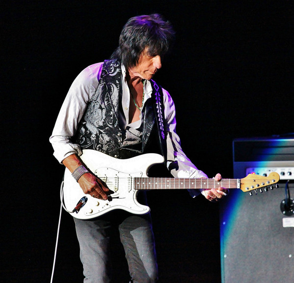

# Jeff Beck

## Artist Profile

British guitarist.
Born: June 24, 1944 in Wallington, Surrey, United Kingdom.

Inducted into Rock And Roll Hall of Fame in 2009 (Performer).

## Artist Links

- [http://www.jeffbeck.com/](http://www.jeffbeck.com/)
- [https://www.facebook.com/jeffbeck/](https://www.facebook.com/jeffbeck/)
- [https://twitter.com/jeffbeckmusic](https://twitter.com/jeffbeckmusic)
- [https://www.instagram.com/jeffbeckofficial/](https://www.instagram.com/jeffbeckofficial/)
- [https://www.youtube.com/user/officialjeffbeck/](https://www.youtube.com/user/officialjeffbeck/)
- [https://www.last.fm/music/Jeff+Beck](https://www.last.fm/music/Jeff+Beck)
- [https://en.wikipedia.org/wiki/Jeff_Beck](https://en.wikipedia.org/wiki/Jeff_Beck)
- [https://www.imdb.com/name/nm0065169/](https://www.imdb.com/name/nm0065169/)

## See also

- [Blow By Blow](Blow_By_Blow.md)
