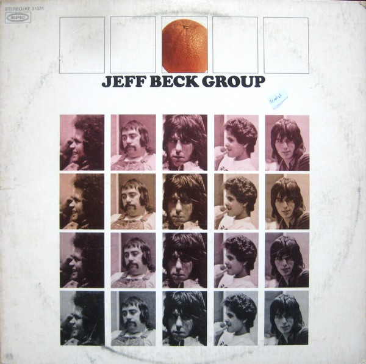

# Jeff Beck Group

By Jeff Beck Group

## Album Data

[Discogs URL](https://www.discogs.com/release/1362776-Jeff-Beck-Group-Jeff-Beck-Group)

- Label: Epic
- Formats: Vinyl, LP, Album
- Genres: Rock, Blues Rock
- Rating: 4.01
- Released: 1972
- Year: 1972
- Release ID: 1362776
- Media condition: 
- Sleeve condition: 
- Speed: 
- Weight: 
- Notes: 

## Album Tracks

| **Position** | **Title** | **Duration** |
|--------------|-----------|--------------|
| A1 | **Ice Cream Cakes** | 5:40 |
| A2 | **Glad All Over** | 2:59 |
| A3 | **Tonight I'll Be Staying Here With You** | 4:57 |
| A4 | **Sugar Cane** | 4:06 |
| A5 | **I Can't Give Back The Love I Feel  For You** | 2:42 |
| B1 | **Going Down** | 6:50 |
| B2 | **I Got To Have A Song** | 3:28 |
| B3 | **Highways** | 4:42 |
| B4 | **Definitely Maybe** | 5:02 |

## Artist Roles

| **Name** | **Role** |
|----------|----------|
| **Clive Chaman** | Bass |
| **Karenlee Grant** | Design [Cover] |
| **Cozy Powell** | Drums |
| **Ron Capone** | Engineer |
| **Jeff Beck** | Guitar |
| **Richie Simpson** | Photography By [Cover Photos] |
| **Max Middleton** | Piano |
| **Steve Cropper** | Producer |
| **Bobby Tench** | Vocals |
| **Jeff Beck** | Written-By |

