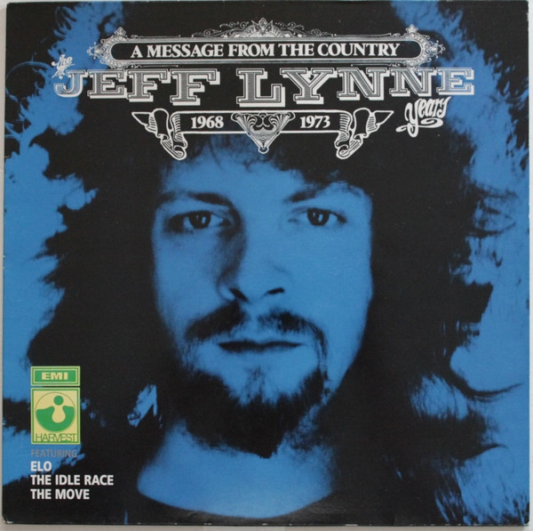

# A Message From The Country - The Jeff Lynne Years 1968 - 1973

By Jeff Lynne

## Album Data

[Discogs URL](https://www.discogs.com/release/4428598-Jeff-Lynne-Featuring-The-Idle-Race-The-Move-Electric-Light-Orchestra-A-Message-From-The-Country-The-)

- Label: Harvest
- Formats: Vinyl, LP, Album, Compilation
- Genres: Rock, Classic Rock, Psychedelic Rock, Symphonic Rock
- Rating: 4.83
- Released: 1989
- Year: 1989
- Release ID: 4428598
- Media condition: 
- Sleeve condition: 
- Speed: 
- Weight: 
- Notes: 

## Album Tracks

| **Position** | **Title** | **Duration** |
|--------------|-----------|--------------|
| A1 | **Do Ya** | 4:05 |
| A2 | **The Minister** | 4:30 |
| A3 | **Girl At The Window** | 3:46 |
| A4 | **Roll Over Beethoven** | 4:35 |
| A5 | **Words Of Aaron** | 5:28 |
| A6 | **Mr. Radio** | 5:05 |
| B1 | **The Skeleton And The Roundabout** | 2:21 |
| B2 | **Message From The Country** | 4:48 |
| B3 | **Come With Me** | 2:45 |
| B4 | **Morning Sunshine** | 1:49 |
| B5 | **10538 Overture (Full Version)** | 5:32 |
| B6 | **Happy Birthday/The Birthday** | 3:24 |
| B7 | **No Time** | 3:42 |
| B8 | **Showdown** | 4:11 |

## Artist Roles

| **Name** | **Role** |
|----------|----------|
| **Jeff Lynne** | Producer |
| **Roy Wood** | Producer |
| **Jeff Lynne** | Written-By |

