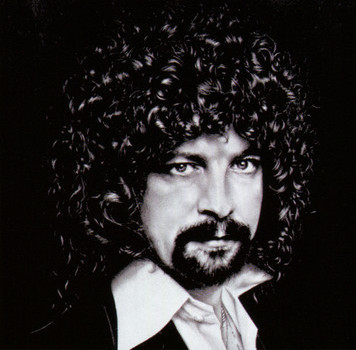

# Jeff Lynne

## Artist Profile

English guitarist, bassist, keyboardist and producer, born 30 December 1947 in Shard End, Birmingham, England. He most notably played for Electric Light Orchestra, Traveling Wilburys and George Harrison among others.

## Artist Links

- [https://www.jefflynneselo.com](https://www.jefflynneselo.com)
- [https://www.facebook.com/JeffLynnesELO](https://www.facebook.com/JeffLynnesELO)
- [https://twitter.com/jefflynneselo](https://twitter.com/jefflynneselo)
- [https://instagram.com/jefflynneselo](https://instagram.com/jefflynneselo)
- [https://www.youtube.com/user/eloofficial](https://www.youtube.com/user/eloofficial)
- [http://www.jefflynnesongs.com](http://www.jefflynnesongs.com)
- [https://en.wikipedia.org/wiki/Jeff_Lynne](https://en.wikipedia.org/wiki/Jeff_Lynne)
- [https://www.elo-fanclub.com](https://www.elo-fanclub.com)
- [http://www.10538overture.dk/Members%20of%20ELO%20and%20Relatives/Jeff%20Lynne%20(ELO)/Fronts/jeff_lynne_history.html](http://www.10538overture.dk/Members%20of%20ELO%20and%20Relatives/Jeff%20Lynne%20(ELO)/Fronts/jeff_lynne_history.html)

## See also

- [A Message From The Country - The Jeff Lynne Years 1968 - 1973](A_Message_From_The_Country_-_The_Jeff_Lynne_Years_1968_-_1973.md)
