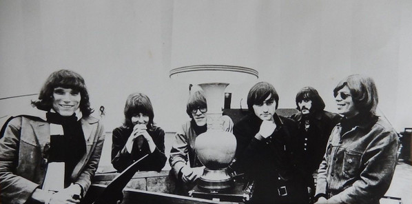

# Jefferson Airplane

## Artist Profile

American psychedelic rock band from San Francisco, CA. During the late 1960s, the band (along with The Grateful Dead) epitomized San Francisco's Haight-Ashbury culture. 

The band began in 1965 when singer Marty Balin met guitarist Paul Kantner. They began as a folk-rock group, added lead guitarist Jorma Kaukonen, drummer Alexander Spence, singer Signe Anderson, and bassist Bob Harvey (7), who was soon replaced by Jack Casady. The group was signed by RCA Victor, and their debut album charted (#128), selling 10,000 copies in the San Francisco area. Anderson left to have a baby and was replaced by Grace Slick, Spence left to form Moby Grape and was replaced by Spencer Dryden, which began the group's definitive lineup. They performed at the Woodstock and Altamont festivals but then had its second major shakeup when Dryden left in 1970 to join New Riders Of The Purple Sage (he was replaced by Joey Covington), and the band stopped touring when Slick became pregnant by Kantner. Kaukonen and Casady formed Hot Tuna In 1971, but remained members of the Airplane. The same year the group formed its own label, Grunt (3), distributed by RCA. In February 1974 Slick and Kantner officially formed the Jefferson Starship, which brought the original phase of the group to a close.

The band was inducted into Rock And Roll Hall of Fame in 1996 as a Performer.

## Artist Links

- [https://jeffersonairplane.com/](https://jeffersonairplane.com/)
- [https://www.facebook.com/JeffersonAirplaneOfficial/](https://www.facebook.com/JeffersonAirplaneOfficial/)
- [https://twitter.com/jeffersonairp](https://twitter.com/jeffersonairp)
- [https://www.instagram.com/jeffersonairplaneofficial/](https://www.instagram.com/jeffersonairplaneofficial/)
- [https://www.youtube.com/channel/UCebgb37-z3_i6Xk_h4ch9YQ](https://www.youtube.com/channel/UCebgb37-z3_i6Xk_h4ch9YQ)
- [https://myspace.com/jeffersonairplane](https://myspace.com/jeffersonairplane)
- [https://en.wikipedia.org/wiki/Jefferson_Airplane](https://en.wikipedia.org/wiki/Jefferson_Airplane)

## See also

- [After Bathing At Baxter's](After_Bathing_At_Baxters.md)
- [Crown Of Creation](Crown_Of_Creation.md)
- [Mexico](Mexico.md)
- [Surrealistic Pillow](Surrealistic_Pillow.md)
