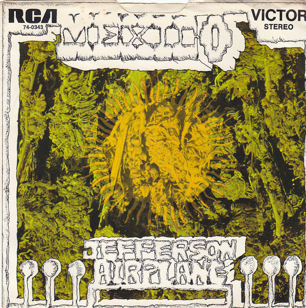

# Mexico

By Jefferson Airplane

## Album Data

[Discogs URL](https://www.discogs.com/release/7327717-Jefferson-Airplane-Mexico)

- Label: RCA Victor
- Formats: Vinyl, 7", 45 RPM, Single, Stereo
- Genres: Rock, Psychedelic Rock
- Rating: 5
- Released: 1970
- Year: 1970
- Release ID: 7327717
- Media condition: 
- Sleeve condition: 
- Speed: 
- Weight: 
- Notes: 

## Album Tracks

| **Position** | **Title** | **Duration** |
|--------------|-----------|--------------|
| A | **Mexico** | 2:07 |
| B | **Have You Seen The Saucers** | 3:37 |

