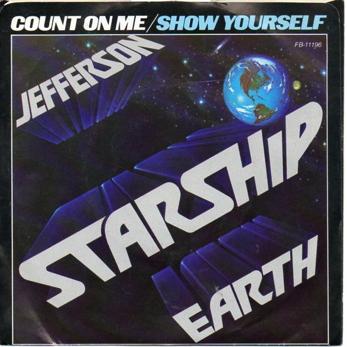

# Count On Me / Show Yourself

By Jefferson Starship

## Album Data

[Discogs URL](https://www.discogs.com/release/1536243-Jefferson-Starship-Count-On-Me-Show-Yourself)

- Label: Grunt (3)
- Formats: Vinyl, 7", 45 RPM, Single, Stereo
- Genres: Rock, Pop Rock, Classic Rock
- Rating: 4.12
- Released: 1978-03-00
- Year: 1978
- Release ID: 1536243
- Media condition: 
- Sleeve condition: 
- Speed: 
- Weight: 
- Notes: 

## Album Tracks

| **Position** | **Title** | **Duration** |
|--------------|-----------|--------------|
| A | **Count On Me** | 3:14 |
| B | **Show Yourself** | 4:36 |

## Artist Roles

| **Name** | **Role** |
|----------|----------|
| **John Golden** | Mastered By |
| **Jefferson Starship** | Producer |
| **Larry Cox** | Producer |

