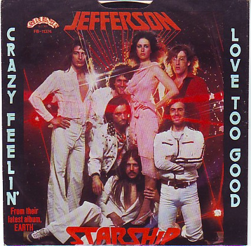

# Crazy Feelin'

By Jefferson Starship

## Album Data

[Discogs URL](https://www.discogs.com/release/2072754-Jefferson-Starship-Crazy-Feelin)

- Label: Grunt (3)
- Formats: Vinyl, 7", 45 RPM, Single, Stereo
- Genres: Rock, Pop Rock
- Rating: 3.67
- Released: 1978
- Year: 1978
- Release ID: 2072754
- Media condition: 
- Sleeve condition: 
- Speed: 
- Weight: 
- Notes: 

## Album Tracks

| **Position** | **Title** | **Duration** |
|--------------|-----------|--------------|
| A | **Crazy Feelin'** | 2:30 |
| B | **Love Too Good** | 4:37 |

## Artist Roles

| **Name** | **Role** |
|----------|----------|
| **Jefferson Starship** | Producer |
| **Larry Cox** | Producer |

