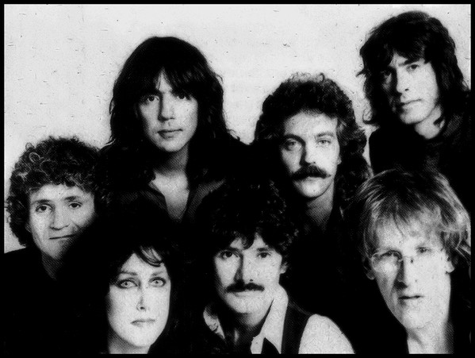

# Jefferson Starship

## Artist Profile

US band formed in 1974 following the break up of Jefferson Airplane. Jack Casady and Jorma Kaukonen left the Airplane to concentrate on their side-project Hot Tuna, the majority of the band Paul Kantner, Grace Slick, David Freiberg, John Barbata and Papa John Creach formed Jefferson Starship with the addition of Craig Chaquico on lead guitar, and Pete Sears on bass and keyboards. They recorded their first band album, Dragonfly in 1974. The band name had been used four years earlier for the all-star band - including David Crosby, Graham Nash and Grateful Dead members Jerry Garcia, Bill Kreutzmann and Mickey Hart - backing Kantner on his solo-album "Blows Against the Empire", credited to Paul Kantner and Jefferson Starship, but it wasn't until 1974 a real band was bearing the name. From 1974 and on the band has undergone almost endless line-up changes finally leaving the band with one of its original members, David Freiberg. Grace Slick was let off in 1978 reportedly due to alcoholic misbehaving but rejoined the band in 1981. Band leader Paul Kantner left the group in 1984 and a settlement prohibiting the use of the band name unless all original members were in the band forced the band to change its name to just Starship (2).

## Artist Links

- [https://web.archive.org/web/20220821110831/http://www.jeffersonstarship.com/index.html](https://web.archive.org/web/20220821110831/http://www.jeffersonstarship.com/index.html)
- [https://web.archive.org/web/20220130014332/http://www.jeffersonstarship.net/](https://web.archive.org/web/20220130014332/http://www.jeffersonstarship.net/)
- [https://web.archive.org/web/20170630182717/http://www.jeffersonstarshipsf.com/](https://web.archive.org/web/20170630182717/http://www.jeffersonstarshipsf.com/)
- [https://www.facebook.com/officialjeffersonstarship](https://www.facebook.com/officialjeffersonstarship)
- [https://twitter.com/JStarship](https://twitter.com/JStarship)
- [https://www.youtube.com/channel/UCi3cZGe7qFaPKgglsYsczbQ](https://www.youtube.com/channel/UCi3cZGe7qFaPKgglsYsczbQ)
- [https://en.wikipedia.org/wiki/Jefferson_Starship](https://en.wikipedia.org/wiki/Jefferson_Starship)

## See also

- [Count On Me / Show Yourself](Count_On_Me_-_Show_Yourself.md)
- [Crazy Feelin'](Crazy_Feelin.md)
- [Light The Sky On Fire](Light_The_Sky_On_Fire.md)
- [Red Octopus](Red_Octopus.md)
