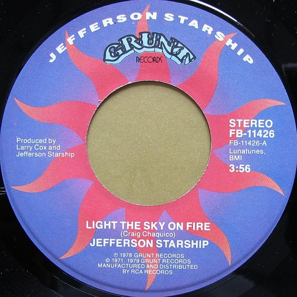

# Light The Sky On Fire

By Jefferson Starship

## Album Data

[Discogs URL](https://www.discogs.com/release/5562004-Jefferson-Starship-Light-The-Sky-On-Fire)

- Label: Grunt (3)
- Formats: Vinyl, 7", 45 RPM, Stereo
- Genres: Rock, Pop Rock
- Rating: 3.5
- Released: 1979
- Year: 1978
- Release ID: 5562004
- Media condition: 
- Sleeve condition: 
- Speed: 
- Weight: 
- Notes: 

## Album Tracks

| **Position** | **Title** | **Duration** |
|--------------|-----------|--------------|
| A | **Light The Sky On Fire** | 3:56 |
| B | **Hyperdrive** | 6:11 |

## Artist Roles

| **Name** | **Role** |
|----------|----------|
| **Jefferson Starship** | Producer |
| **Larry Cox** | Producer |

