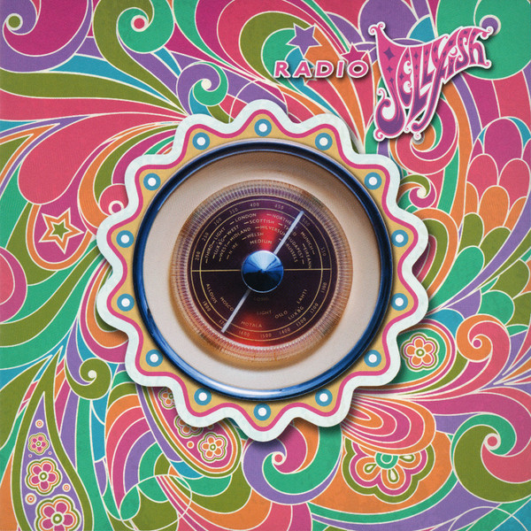

# Radio Jellyfish

By Jellyfish

## Album Data

[Discogs URL](https://www.discogs.com/release/5163094-Jellyfish-Radio-Jellyfish)

- Label: Omnivore Recordings
Universal Music Special Markets
- Formats: Vinyl, LP, Album
- Genres: Rock, Pop, Power Pop, Acoustic, Pop Rock
- Rating: 4.19
- Released: 2013-12-03
- Year: 2013
- Release ID: 5163094
- Media condition: 
- Sleeve condition: 
- Speed: 
- Weight: 
- Notes: 

## Album Tracks

| **Position** | **Title** | **Duration** |
|--------------|-----------|--------------|
| A1 | **New Mistake** | 4:04 |
| A2 | **She Still Loves Him** | 3:55 |
| A3 | **I Can Hear The Grass Grow** | 4:01 |
| A4 | **Baby's Coming Back** | 3:04 |
| A5 | **The Man I Used To Be** | 4:40 |
| B1 | **Joining A Fan Club** | 3:41 |
| B2 | **The King Is Half-Undressed** | 3:37 |
| B3 | **The Ghost At Number One** | 3:44 |
| B4 | **That Is Why** | 4:08 |
| B5 | **No Matter What** | 2:51 |

## Artist Roles

| **Name** | **Role** |
|----------|----------|
| **Eric Dover** | Guitar |
| **Tim Smith (5)** | Guitar |
| **Roger Joseph Manning Jr.** | Keyboards, Vocals, Percussion |
| **Andy Sturmer** | Vocals, Percussion |

