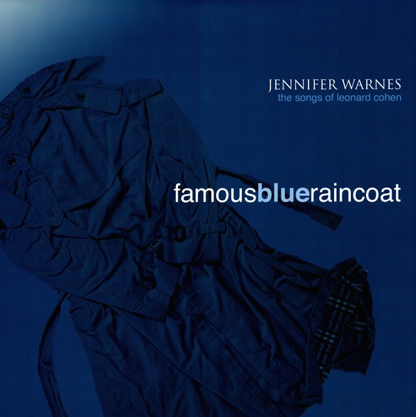

# Famous Blue Raincoat (The Songs Of Leonard Cohen)

By Jennifer Warnes

## Album Data

[Discogs URL](https://www.discogs.com/release/7550126-Jennifer-Warnes-Famous-Blue-Raincoat-The-Songs-Of-Leonard-Cohen)

- Label: Impex Records
- Formats: Vinyl, LP, Album, Reissue, Remastered, Stereo
- Genres: Rock, Pop, Soft Rock, Vocal, Ballad
- Rating: 4.72
- Released: 2015-10-16
- Year: 1986
- Release ID: 7550126
- Media condition: 
- Sleeve condition: 
- Speed: 
- Weight: 
- Notes: 

## Album Tracks

| **Position** | **Title** | **Duration** |
|--------------|-----------|--------------|
| A1 | **First We Take Manhattan** | 3:44 |
| A2 | **Bird On A Wire** | 4:42 |
| A3 | **Famous Blue Raincoat** | 5:33 |
| A4 | **Joan Of Arc** | 7:47 |
| B1 | **Ain't No Cure For Love** | 3:19 |
| B2 | **Coming Back To You** | 3:42 |
| B3 | **Song Of Bernadette** | 3:58 |
| B4 | **A Singer Must Die** | 4:50 |
| B5 | **Came So Far For Beauty** | 3:37 |

## Artist Roles

| **Name** | **Role** |
|----------|----------|
| **Leslie Wintner** | Art Direction, Design |
| **Jennifer Warnes** | Art Direction, Producer |
| **Vinnie Colaiuta** | Drums |
| **Clive Taylor** | Engineer [Assistant] |
| **Dan Reed (5)** | Engineer [Assistant] |
| **Duane Seykora** | Engineer [Assistant] |
| **Garth Richardson** | Engineer [Assistant] |
| **Jeff Park** | Engineer [Assistant] |
| **Joel Stoner** | Engineer [Assistant] |
| **Ken Fowler** | Engineer [Assistant] |
| **Nyya Lark** | Engineer [Assistant] |
| **Russell Bracher** | Engineer [Assistant] |
| **Sharon Rice (2)** | Engineer [Assistant] |
| **Steve Ford** | Engineer [Assistant] |
| **Terry Dunavan** | Engineer [Assistant] |
| **Billy Youdelman** | Engineer [Chief Recording Engineer] |
| **Bernie Grundman** | Lacquer Cut By |
| **Leonard Cohen** | Lyrics By |
| **Bernie Grundman** | Mastered By |
| **Bill Elliott** | Music By |
| **John Lissauer** | Music By |
| **Leonard Cohen** | Music By |
| **Betsy Annas** | Photography By [Back Cover] |
| **Roscoe Beck** | Producer |
| **Jennifer Warnes** | Producer, Music By, Lyrics By |
| **Chuck Barth** | Programmed By |
| **Todd Yyega** | Programmed By |
| **Bernie Grundman** | Remastered By |

