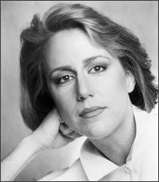

# Jennifer Warnes

## Artist Profile

American singer/songwriter, arranger, record producer, concert performer and television performer, born March 3, 1947 in Seattle, Washington, USA and raised in Anaheim, California, USA. She was also a close friend and collaborator of Canadian singer-songwriter and poet Leonard Cohen.

## Artist Links

- [https://www.jenniferwarnes.com/](https://www.jenniferwarnes.com/)
- [https://en.wikipedia.org/wiki/Jennifer_Warnes](https://en.wikipedia.org/wiki/Jennifer_Warnes)
- [https://www.imdb.com/name/nm0912620/](https://www.imdb.com/name/nm0912620/)

## See also

- [Famous Blue Raincoat (The Songs Of Leonard Cohen)](Famous_Blue_Raincoat_The_Songs_Of_Leonard_Cohen.md)
